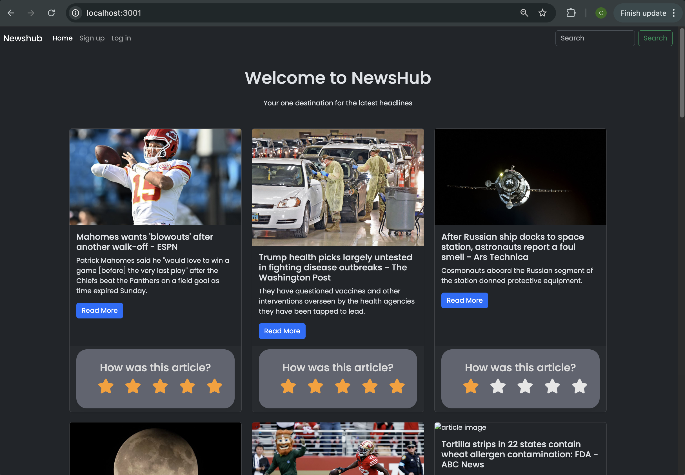
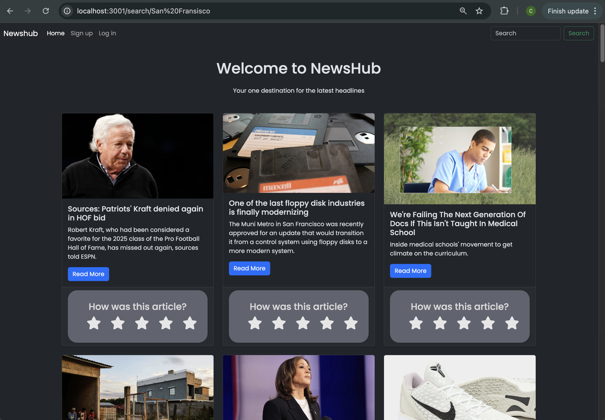
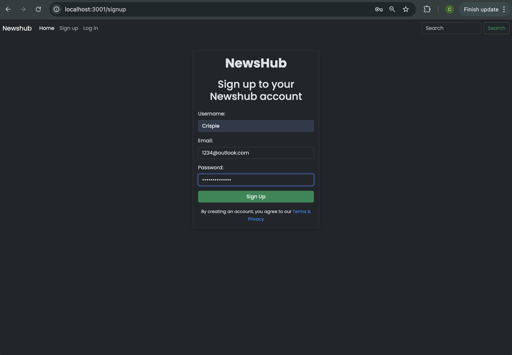
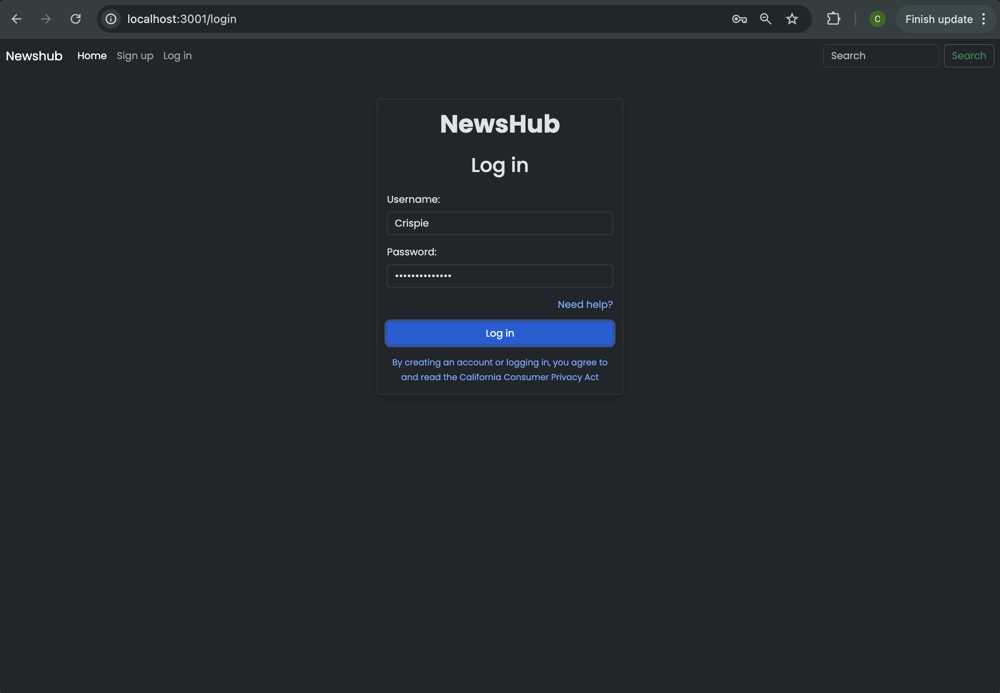

# NewsHub

## Description

Welcome to the News Hub project! This platform allows users to stay up-to-date with the latest news articles, engage with the content by rating or commenting, and access a personalized page where they can track their interactions. The News Hub is designed to give readers a customized news experience by providing the following features:

## Features

1. User Accounts and Authentication
   Sign Up / Log In: Users can create a new account or log in to an existing one.
   Personalized Profile: Once signed in, users can access their own personalized dashboard.
   Manage Content: Users can view articles they've rated, commented on, or interacted with in any way.
2. Article Ratings and Comments
   Rate Articles: Users can rate articles they read on a scale (e.g., 1 to 5 stars).
   Commenting: Users can leave comments on articles to share their thoughts, opinions, or engage in discussions.
3. Search Functionality
   Search Bar: Users can search for specific news articles using keywords from the title or content.
   Real-time Results: As users type, suggested articles related to the search term will be displayed for easy navigation.
4. User Dashboard
   Article History: View all the articles that a user has interacted with, including those they rated or commented on.
   Personalized Feed: Display articles based on user preferences or previous activity (e.g., articles the user has rated highly or commented on).
   Getting Started
   To get started with News Hub, follow these simple steps:

## Installation

You need to download node and than a npm i to install all the files

Technologies Used
Frontend:

Backend:

Node.js with Express for building the server-side application

## Credits

Alexander Mena, Crispin Duarte, Tina Rahimian, Karol Sytwu

## User Experiance

When i look up the page i can see the what top rated news is out there.
When i search aricles i can see what other news is there.
When i login in i get to see the rating i placed on the articles.
If i dont have a user i can signup.

## Images

## Links

https://newshub-5k9b.onrender.com/

https://github.com/Alexm415/NewsHub

This project is licensed under the MIT License - see the LICENSE file for details.
